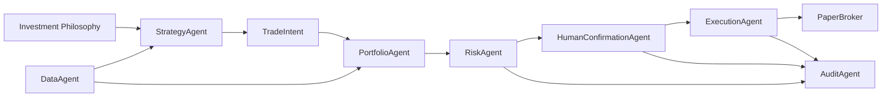

# Trading Agent Scaffold Design

## Goal

Build a small, testable paper-trading agent framework that turns the investment philosophy in `docs/investment-philosophy.md` into deterministic trading workflow gates. The system will use mock market/account data and a paper broker in v1, with clean interfaces for future Alpaca, SEC EDGAR, and fundamentals-provider integrations.

This scaffold is not intended to optimize returns yet. Its first purpose is to prove the agent data flow, enforce safety rules, require human confirmation, and produce an audit trail for every proposed trade.

## Scope

In scope:

- Python package under `src/stock_agent`
- Typed domain models for portfolio state, market snapshots, trade intents, risk decisions, confirmations, and execution results
- Agent classes for data, strategy, portfolio construction, risk, human confirmation, execution, and audit logging
- Markdown policy loader that reads the investment philosophy file
- Mock data provider and paper broker
- CLI entrypoint that runs one paper-trading evaluation cycle
- Unit tests for risk rules, human confirmation, and basic workflow behavior

Out of scope for v1:

- Live brokerage execution
- Real Alpaca/FMP/SEC API integration
- Real-time streaming data
- ML model training
- Tax optimization beyond surfacing tax-lot implications in portfolio decisions
- Autonomous order execution without human confirmation

## Architecture

The implementation will use explicit, bounded agents rather than a free-form autonomous LLM. Each agent owns one decision boundary and communicates through typed objects.

```text
DataAgent
  -> MarketSnapshot, FundamentalSnapshot, PortfolioState

StrategyAgent
  -> TradeIntent

PortfolioAgent
  -> PortfolioReview

RiskAgent
  -> RiskDecision

HumanConfirmationAgent
  -> HumanConfirmation

ExecutionAgent
  -> ExecutionResult

AuditAgent
  -> JSONL audit records
```

The orchestrator will call agents in sequence for a single evaluation cycle:

1. Load investment philosophy policy.
2. Fetch mock market, fundamental, and portfolio data.
3. Generate trade intents from the strategy agent.
4. Review portfolio constraints, including max holdings, max stock weight, weekly rebalance preference, and tax notes.
5. Run risk checks for hard rules.
6. Request human confirmation for approved intents.
7. Execute approved and confirmed intents against the paper broker.
8. Write audit records for all approvals, rejections, confirmations, and execution results.

## Components

### Domain Models

`models.py` will define dataclasses or Pydantic-style typed objects. The preferred v1 choice is standard-library dataclasses to keep dependencies small.

Core models:

- `Asset`
- `MarketSnapshot`
- `FundamentalSnapshot`
- `Position`
- `PortfolioState`
- `TaxLot`
- `TradeIntent`
- `PortfolioReview`
- `RiskDecision`
- `HumanConfirmation`
- `ExecutionResult`

### Policy Loader

The policy loader will read `docs/investment-philosophy.md` and expose structured defaults used by the agents:

- Allowed asset types: stock, ETF, venture fund
- Disallowed assets: penny stocks, leveraged ETFs
- Sector focus: energy, space technology, biotechnology, artificial intelligence
- Max holdings: 10
- Max single-stock weight: 25%
- Max daily buy amount: 10% of total account value
- No margin
- No shorting
- Human confirmation required for every execution

For v1, the structured defaults will be encoded in code and tied to the markdown policy path. The markdown is the human-readable source of truth; the code enforces the corresponding rules.

### Data Agent

The data agent will use a mock provider in v1. It returns:

- A current portfolio state
- A small list of candidate market snapshots
- Simplified fundamental snapshots
- Optional tax-lot context

Future data providers can implement the same interface for Alpaca, SEC EDGAR, and normalized fundamentals APIs.

### Strategy Agent

The strategy agent converts candidate data into trade intents. The initial strategy is intentionally simple:

- Prefer assets matching the sector focus
- Prefer quality companies with temporary drawdowns
- Avoid assets near earnings when earnings date data is available
- Require a plain-language rationale

It does not talk to the broker and does not decide whether execution is allowed.

### Portfolio Agent

The portfolio agent evaluates how a trade would affect allocation:

- Holding count after trade
- Post-trade single-stock weight
- Weekly rebalance preference
- Concentration warnings
- Tax implication notes when a trade would realize gains or losses

It produces review output for the risk and human-confirmation steps.

### Risk Agent

The risk agent enforces hard rules:

- Block margin
- Block shorting
- Block penny stocks
- Block leveraged ETFs
- Block buys above 10% of total account value in one day
- Block single-stock weights above 25%
- Block more than 10 holdings
- Block execution if account or market state is unreconciled
- Block execution if human confirmation is missing

The risk agent can also emit soft warnings for sector concentration, liquidity, unusual volatility, thesis uncertainty, or correlated exposure.

### Human Confirmation Agent

The human confirmation agent will require explicit approval before execution. For v1, it can operate in CLI mode:

- Show symbol, side, amount, weight, rationale, risk checks, warnings, and portfolio impact
- Accept `approve` or `reject`
- Require any changed trade to rerun portfolio and risk checks

Tests can use a non-interactive confirmation provider to simulate approval or rejection.

### Execution Agent

The execution agent only talks to the paper broker in v1. It verifies that the final order matches the approved trade intent before submission.

The paper broker will simulate:

- Accepted orders
- Rejected orders
- Position and cash updates
- Execution result records

### Audit Agent

The audit agent will write JSONL records to `logs/audit.jsonl`. Every proposed trade should produce audit output, including rejected trades.

Required fields:

- Timestamp
- Agent or component
- Input references
- Trade intent
- Portfolio review
- Risk decision
- Human confirmation result
- Execution result, when applicable
- Final outcome

## Data Flow



## Error Handling

The orchestrator should fail closed:

- Missing policy file blocks execution.
- Invalid or stale data blocks execution.
- Unreconciled account state blocks execution.
- Any hard-risk failure blocks execution.
- Missing human confirmation blocks execution.
- Paper broker rejection is logged and does not retry automatically.

Failures should be represented as explicit decisions or execution results and written to the audit log.

## Testing

Focused unit tests should cover:

- Risk blocks short trades.
- Risk blocks margin trades.
- Risk blocks leveraged ETFs and penny stocks.
- Risk blocks buys above 10% of account value in one day.
- Risk blocks single-stock allocations above 25%.
- Risk blocks more than 10 holdings.
- Execution does not run without human confirmation.
- Approved and confirmed paper trade produces an execution result and audit record.
- Rejected trade is logged.

## Acceptance Criteria

The implementation is complete when:

- `python -m stock_agent.run_once` runs one mock paper-trading cycle.
- No broker integration or real money path exists.
- A trade intent cannot reach execution without risk approval and human confirmation.
- The investment philosophy hard rules are enforced by tests.
- Audit records are written for proposed trades.
- The test suite passes locally.
